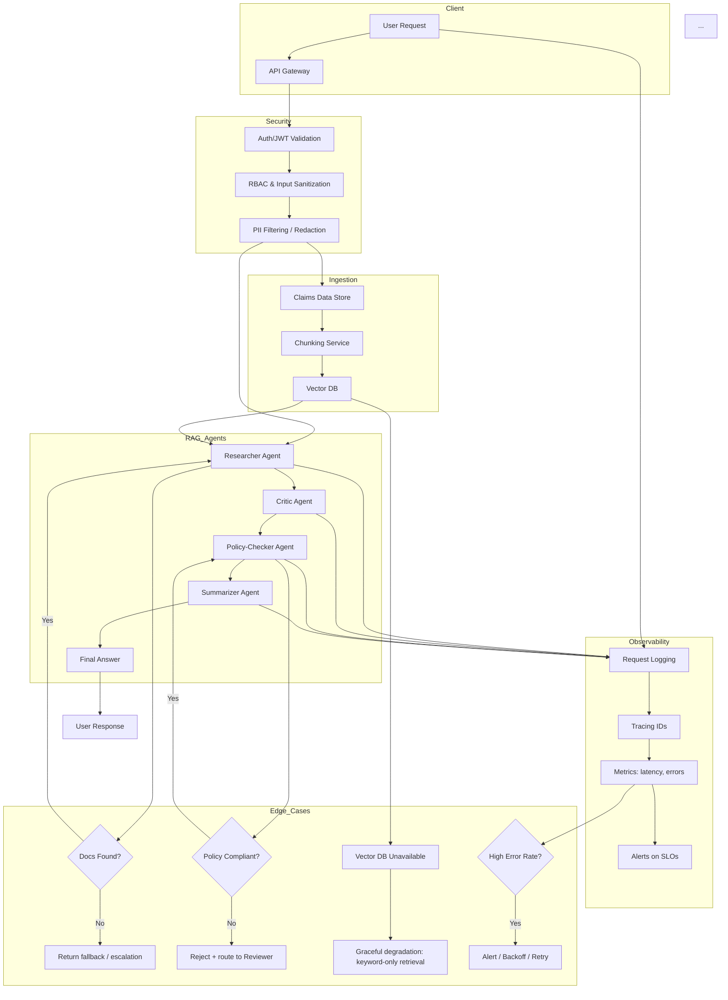

```mermaid
sequenceDiagram
    participant User
    participant Gateway
    participant Auth
    participant Agents
    participant VectorDB
    participant Storage
    participant Metrics

    User->>Gateway: POST /ask
    Gateway->>Auth: Validate JWT
    Auth-->>Gateway: Auth OK
    Gateway->>Agents: Start Researcher
    Agents->>VectorDB: Query chunks
    VectorDB-->>Agents: Retrieved chunks
    Agents->>Agents: Critic refines
    Agents->>Agents: Policy‑Checker validates
    Agents->>Agents: Summarizer formats
    Agents-->>Gateway: Final answer
    Gateway-->>User: JSON response
    Gateway->>Metrics: Log request + latency
    ...
```