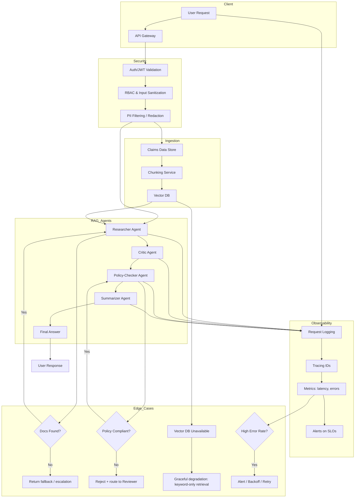
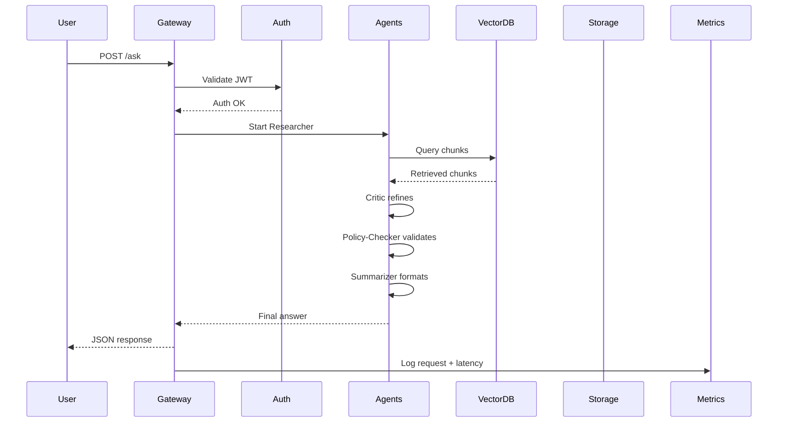

# Claims‑Smart RAG Agent System – Architecture

This document describes the **high‑level architecture** of the **Claims‑Smart RAG Agent System**, including the main components, data flow, multi‑agent interactions, and how **security**, **edge cases**, and **observability** are handled. [file:61]

---

## 1. High‑Level System Flow

The diagram below shows the **end‑to‑end flow** from the **user request** through the **API gateway**, **security layer**, **ingestion and vector store**, **RAG agents**, and finally back to the user, with **observability** and **edge‑case handling** embedded in the design. [file:61][web:16][web:19]

### 1.1 Component overview

- **Client / API Gateway**
  - **User Request** (`A`) enters via an **API Gateway** (`B`), which acts as a front door for all traffic (rate limiting, routing, etc.). [file:61]

- **Security**
  - **Auth/JWT Validation** (`C`): verifies identity and token validity.
  - **RBAC & Input Sanitization** (`D`): enforces **role‑based access control** and cleans input.
  - **PII Filtering / Redaction** (`E`): strips or masks sensitive data before downstream processing.

- **Ingestion & Vector Store**
  - **Claims Data Store** (`F`): holds raw and/or preprocessed claims documents.
  - **Chunking Service** (`G`): splits documents into semantically meaningful chunks.
  - **Vector DB** (`H`): stores embeddings of chunks for retrieval‑augmented generation (RAG).

- **RAG Agents**
  - **Researcher Agent** (`I`): retrieves relevant chunks from **Vector DB** and drafts a candidate answer.
  - **Critic Agent** (`J`): reviews the draft answer for quality and hallucinations.
  - **Policy‑Checker Agent** (`K`): validates the answer against claims policies/rules.
  - **Summarizer Agent** (`L`): creates the final user‑facing answer (`M`), with explanations and rationale.

- **Observability**
  - **Request Logging** (`N`): logs incoming requests and intermediate agent steps.
  - **Tracing IDs** (`O`): attaches correlation/trace IDs through the request lifecycle.
  - **Metrics** (`P`): captures latency, error rates, volumes.
  - **Alerts on SLOs** (`Q`): triggers alerts when SLOs are violated (e.g., high error rate, slow responses).

- **Edge Cases**
  - **Docs Found?** (`R`): if no documents are found, the system returns a **fallback** or escalates (`S`).
  - **Policy Compliant?** (`T`): if not compliant, a reviewer or correction flow is triggered (`U`).
  - **Vector DB Unavailable** (`V`): system falls back to **keyword‑only retrieval** (`W`) instead of failing hard.
  - **High Error Rate?** (`X`): triggers **alerts / backoff / retry** (`Y`) when metrics indicate systemic issues.

---

## 2. Sequence of Interactions

The sequence diagram shows the **runtime interaction** between the core components for a single request, focusing on message flow rather than boxes. [file:61][web:30]

### 2.1 Interaction explanation

1. **User → Gateway**
   - The **user** sends a `POST /ask` request to the **API Gateway** with a question or claim‑related query.

2. **Gateway → Auth**
   - The gateway forwards the request to the **Auth** service to validate JWT or other credentials.
   - On success, **Auth** returns an “Auth OK” response.

3. **Gateway → Agents**
   - The gateway invokes the **multi‑agent pipeline** (e.g., through a coordinator) to start the **Researcher Agent**.

4. **Agents ↔ VectorDB & Storage**
   - The **Researcher Agent** queries **VectorDB** for relevant chunks.
   - **VectorDB** returns retrieved chunks, potentially using data stored in **Storage**.

5. **Intra‑agent steps**
   - Within **Agents**, messages flow:
     - Researcher drafts an answer.
     - **Critic** refines/checks for quality.
     - **Policy‑Checker** validates against policies.
     - **Summarizer** formats the final answer.

6. **Agents → Gateway → User**
   - The multi‑agent pipeline returns the **final answer** to the **Gateway**.
   - The **Gateway** returns a **JSON response** to the **User**.

7. **Gateway → Metrics**
   - The gateway logs request metadata and **latency** to **Metrics**, feeding observability (monitoring/alerting dashboards).

---

## 3. Security Considerations (Summary)

- **Authentication:** All requests pass through **JWT/Auth validation** before any agents or data stores are accessed. [file:61]  
- **Authorization:** **RBAC** ensures only permitted roles can access or modify certain data/operations.  
- **Input Sanitization & PII:** Requests are sanitized and **PII is redacted** before logging or downstream processing, reducing exposure in logs and traces.

---

## 4. Observability & Edge‑Case Handling (Summary)

- **Observability:**
  - Centralized **request logging** with correlation IDs for each request.
  - **Metrics** on latency, error rates, and per‑agent performance.
  - **Alerts** on SLO violations (e.g., high P95 latency). [file:61]

- **Edge‑Case Handling:**
  - **No documents found:** graceful fallback (explanation + possible escalation to human).  
  - **Policy violations:** explicit rejection with explanation and optional reviewer workflow.  
  - **Vector DB down:** degrade to keyword/BM25 retrieval rather than failing.  
  - **Systemic issues:** error‑rate based alerting and potentially automated backoff/retry.

---

## 5. Future Extensions

- Map components to specific **cloud services** (e.g., AWS Bedrock, Lambda/ECS, or Vertex AI/ADK).  
- Add detailed **sequence diagrams** for:
  - Ingestion & indexing flows.
  - Policy update flows.
  - Human‑in‑the‑loop override flows.

This architecture document should be kept in sync with implementation and updated as new components (e.g., CI/CD, testing layers, ADK workflows) are added.