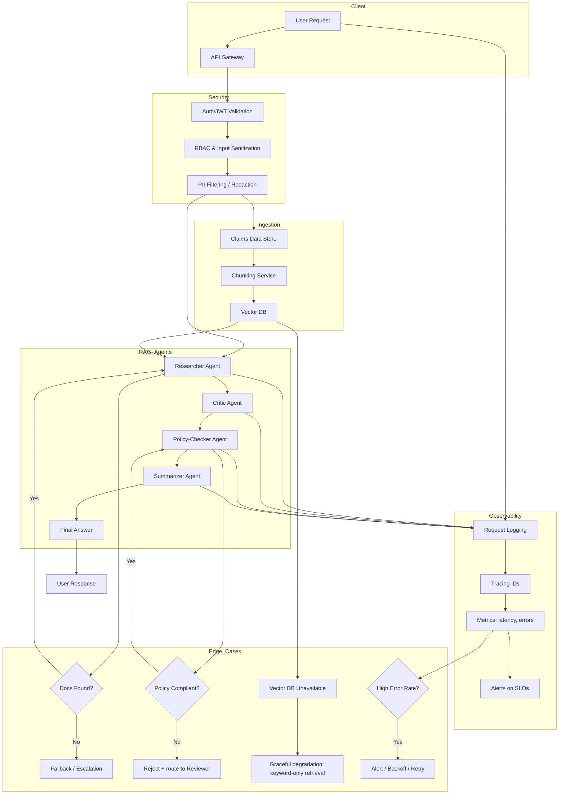
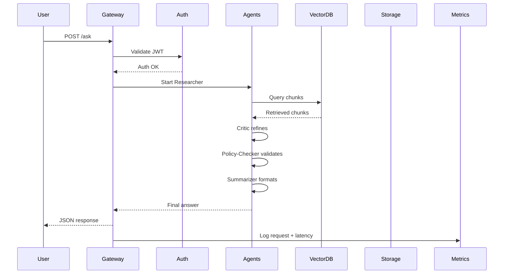

# Claims‑Smart RAG Agent System – Learning & Build Plan

**Author:** Sumit  
**Goal:** Learn **RAG**, **ML/DL/NLP**, and **multi‑agent architectures with ADK** by building an end‑to‑end system: **Claims‑Smart RAG Agent System**.

Time budget: **6 hours/week** for **24 weeks (≈6 months)**.

---

## 1. Project Overview

**Project name:** `claims-smart-rag-agent`  

**High‑level idea:**  
A **multi‑agent RAG system** that answers questions over **CMS‑1500 / claims‑style documentation**, validates answers against **claims policies**, and provides **explanations** with security and observability baked in.

**Key components:**

- **Ingestion:** PDF / OCR → text → chunking.
- **Vector store:** Stores chunks for **retrieval‑augmented generation (RAG)**.
- **Multi‑agent loop:**
  - **Researcher Agent** – retrieves and synthesizes candidate info.
  - **Critic Agent** – checks for reasoning quality and hallucinations.
  - **Policy‑Checker Agent** – validates against explicit rules/policies.
  - **Summarizer Agent** – composes final answer and explanation.
- **Security:** Auth/JWT, RBAC, PII redaction, audit logging.
- **Observability:** Structured logs, traces, metrics, alerts.

---

## 2. Core References & Learning Links

### 2.1 RAG and Vector Databases

- DeepLearning.AI / Coursera – **Retrieval‑Augmented Generation (RAG)**  
  - https://www.coursera.org/learn/retrieval-augmented-generation-rag  <!-- [web:1] -->
  - https://learn.deeplearning.ai/courses/retrieval-augmented-generation/information  <!-- [web:2] -->
- AWS – **What is RAG?**  
  - https://aws.amazon.com/what-is/retrieval-augmented-generation/  <!-- [web:3] -->
- Google Cloud – **What is Retrieval‑Augmented Generation?**  
  - https://cloud.google.com/use-cases/retrieval-augmented-generation  <!-- [web:5] -->
- Pinecone – **RAG guide & vector DB basics**  
  - https://www.pinecone.io/learn/retrieval-augmented-generation/  <!-- [web:11] -->
- Databricks – **RAG concepts & retrieval quality**  
  - https://www.databricks.com/blog/what-is-retrieval-augmented-generation  <!-- [web:14] -->

### 2.2 ML / DL / NLP

- Machine learning frameworks overview  
  - https://learningactors.com/the-ultimate-guide-to-machine-learning-frameworks/  <!-- [web:9] -->
- Deep learning frameworks (PyTorch, TensorFlow)  
  - https://fritz.ai/best-deep-learning-frameworks/  <!-- [web:6] -->
- NLP complete guide  
  - https://www.deeplearning.ai/resources/natural-language-processing/  <!-- [web:12] -->
- PyTorch – **Deep Learning for NLP with PyTorch**  
  - https://docs.pytorch.org/tutorials/beginner/nlp/index.html  <!-- [web:15] -->

### 2.3 Multi‑Agent Architectures & ADK

- Google course – **Deploy Multi‑Agent Systems with ADK and Agent Engine**  
  - https://www.skills.google/course_templates/1275  <!-- [web:7] -->
- Guide – **The Complete Guide to Google’s Agent Development Kit (ADK)**  
  - https://sidbharath.com/blog/the-complete-guide-to-googles-agent-development-kit-adk/  <!-- [web:10] -->
- Google developer blog – **Multi‑agent patterns in ADK**  
  - https://developers.googleblog.com/developers-guide-to-multi-agent-patterns-in-adk/  <!-- [web:13] -->

### 2.4 Mermaid.js Diagrams

- Mermaid examples & syntax  
  - https://mermaid.js.org/syntax/examples.html  <!-- [web:16] -->
  - https://mermaid.ai/open-source/syntax/flowchart.html  <!-- [web:19] -->
  - https://mermaid.ai/open-source/syntax/sequenceDiagram.html  <!-- [web:30] -->

---

## 3. Week‑by‑Week Plan (24 Weeks, 6 Hours/Week)

> Typical week: **1–2 hours** content (videos/docs) + **4–5 hours** hands‑on coding on this project.

### Months 1–2 – RAG + ML/NLP Foundations

#### Week 1 – RAG Fundamentals & Project Setup

- Start DeepLearning.AI/Coursera **RAG course**, Modules 1–2. <!-- [web:1][web:2] -->
- Define **project scope** and initial architecture (high‑level).
- Initialize Git repo, create basic project structure (`src`, `docs`, `tests`, `PLAN.md`).

#### Week 2 – Data Ingestion Pipeline

- Implement **PDF/text ingestion**:
  - Use PyPDF or OCR to extract text from CMS‑style documents.
- Store raw text in a local DB or files for now.
- Draft initial **data model** for claims docs (fields, metadata).

#### Week 3 – Chunking & Vector Store

- Implement **chunking strategies**:
  - Fixed‑size tokens / characters.
  - Sentence or section‑aware chunking.
- Stand up a **vector store**:
  - Use PGVector, Weaviate, or Pinecone. <!-- [web:11] -->
- Write scripts to index chunks into the vector DB.

#### Week 4 – Baseline Retrieval and QA API

- Implement a **baseline RAG pipeline**:
  - Input question → retrieve top‑k chunks → call LLM → answer.
- Use **dense retrieval only** as baseline. <!-- [web:2][web:14] -->
- Wrap into a simple **FastAPI** or **Flask** endpoint.

#### Week 5 – RAG Evaluation & Metrics

- Define small **evaluation set** of Q&A pairs manually.
- Track:
  - Retrieval quality (does context contain the answer?).
  - Latency (end‑to‑end).
- Experiment with **reranking** or **top‑k tuning**. <!-- [web:14] -->

#### Week 6 – ML Refresher (scikit‑learn)

- Use `scikit-learn` to build a simple **classifier**:
  - E.g., classify claim type / category from text. <!-- [web:9] -->
- Implement train/validation split and basic metrics:
  - Accuracy, precision, recall, F1.
- Document how this **classifier could become a tool** for agents.

#### Week 7 – NLP Fundamentals with PyTorch

- Work through **PyTorch NLP tutorial** (e.g., sentiment analysis). <!-- [web:15] -->
- Understand embeddings, simple RNNs / sequence models.
- Integrate a small NLP model (e.g., sentiment or category) into your project as a callable service.

#### Week 8 – Improved RAG (Hybrid Retrieval)

- Add **BM25 or keyword‑based retrieval** and build a **hybrid retriever** (keyword + vector). <!-- [web:2][web:14] -->
- Compare:
  - Dense vs BM25 vs hybrid on your evaluation set.
- Log quantitative results in your repo (`docs/evaluation.md`).

---

### Months 3–4 – Multi‑Agent Design & Implementation

#### Week 9 – PyTorch Deepening

- Continue PyTorch tutorials:
  - Feed‑forward nets, regularization, better training loops. <!-- [web:6][web:15] -->
- Take notes on how you’d refactor your classifier/RAG to leverage these patterns.

#### Week 10 – Agent Role Design

- Design 4 agents:
  - **Researcher Agent** – queries vector DB, drafts answers.
  - **Critic Agent** – checks answer for consistency and hallucinations.
  - **Policy‑Checker Agent** – enforces rules on claims.
  - **Summarizer Agent** – produces final user‑ready response.
- Document responsibilities & inputs/outputs in `docs/agents.md`. <!-- [web:13] -->

#### Week 11 – Orchestration Layer (v1)

- Implement a **simple multi‑agent orchestrator**:
  - Use LangGraph or custom Python graph of steps.
- Initial flow:
  - User → Researcher → Critic → Summarizer.
- Integrate with existing **RAG pipeline** (Week 4–5).

#### Week 12 – Policy‑Aware RAG

- Implement **claims policy rules** (e.g., certain fields required together).
- Integrate a **Policy‑Checker Agent**:
  - Consumes context and draft answer.
  - Returns compliant / non‑compliant + reasons.
- Modify flow: Researcher → Critic → Policy‑Checker → Summarizer.

#### Week 13 – Validation Loops & Self‑Correction

- Implement loop patterns:
  - If Policy‑Checker rejects, send back to Researcher with feedback.
  - Limit retries and track number of cycles.
- Log **decision paths** with trace IDs for debugging. <!-- [web:13] -->

#### Week 14 – Edge‑Case Handling

- Implement handlers for:
  - No documents found.
  - Low retrieval confidence (e.g., low similarity).
  - Ambiguous policy or conflicting rules.
- Define fallback behavior:
  - Escalate to human.
  - Return partial answer with caveats.

#### Week 15 – Security (Auth, RBAC, PII)

- Add **auth** to API (JWT/OAuth stub).
- Implement basic **RBAC** (roles like `claims-viewer`, `claims-admin`).
- Add **PII redaction** for logs and responses (mask PHI‑like patterns).
- Document security posture in `docs/security.md`.

#### Week 16 – Observability (Logging & Metrics)

- Implement:
  - Structured JSON logging.
  - Request/response logging with correlation IDs.
  - Basic metrics (request count, latency, error rate).
- Sketch out how you’d integrate **Prometheus/Grafana** and **tracing**.

---

### Months 5–6 – ADK + Architecture Polish

#### Week 17 – ADK Fundamentals

- Start Google course **“Deploy Multi‑Agent Systems with ADK and Agent Engine”**. <!-- [web:7] -->
- Learn ADK concepts:
  - Agents, tools, workflows, YAML specs, and the Agent Engine runtime. <!-- [web:10] -->

#### Week 18 – ADK Model of Your Agents

- Translate your 4 agents into **ADK YAML definitions**:
  - Inputs/outputs, tools, policies. <!-- [web:10][web:13] -->
- Store them under `adk/` in your repo.
- Map your current Python orchestrator to ADK’s concepts.

#### Week 19 – Optional: Vertex AI Flow

- Build a **simplified multi‑agent flow** in Vertex AI Agent Engine:
  - E.g., Researcher → Summarizer only. <!-- [web:7][web:10] -->
- Compare the experience vs your Python orchestration.

#### Week 20 – Security Hardening

- Strengthen security:
  - JWT verification, token expiry, audience checks.
  - More explicit RBAC on each endpoint.
  - Audit trail for agent‑level decisions and overrides.
- Update `docs/security.md` with threats & mitigations.

#### Week 21 – Observability Hardening

- Add:
  - Tracing (e.g., OpenTelemetry stubs).
  - More granular metrics (per agent, per tool).
  - Alert conditions (e.g., error rate > X%, P95 latency > Y ms).
- Document observability approach in `docs/observability.md`.

#### Week 22 – Edge‑Case Flows & SLOs

- Define **SLIs/SLOs** (latency, availability, correctness).
- Define behavior for:
  - Vector DB down.
  - LLM provider unavailable / rate‑limited.
  - Policy changes (drift).
  - User override for blocked responses. <!-- [web:13][web:14] -->
- Capture this in `docs/edge-cases.md`.

#### Week 23 – Architecture Documentation

- Write a consolidated **architecture doc**:
  - High‑level diagram.
  - Data flow.
  - Agents & responsibilities.
  - Security & observability.
- Place in `docs/architecture.md`.

#### Week 24 – Mermaid Diagrams & Final Polish

- Add **Mermaid diagrams** to `docs/architecture.md`:

**Flowchart:**



**Sequence Diagram:**



- Review code & docs for clarity and completeness.
- Tag a **v0.1.0** release in Git.

---

## 4. Suggested Repo Structure

```text
claims-smart-rag-agent/
  PLAN.md
  README.md
  .gitignore
  requirements.txt

  src/
    api/
    ingestion/
    rag/
    agents/
    security/
    observability/

  tests/
    unit/
    integration/

  docs/
    architecture.md
    agents.md
    security.md
    observability.md
    edge-cases.md
    evaluation.md

  adk/
    agents/
    workflows/
```

This `PLAN.md` is your **single source of truth** for learning and implementation across the next six months.